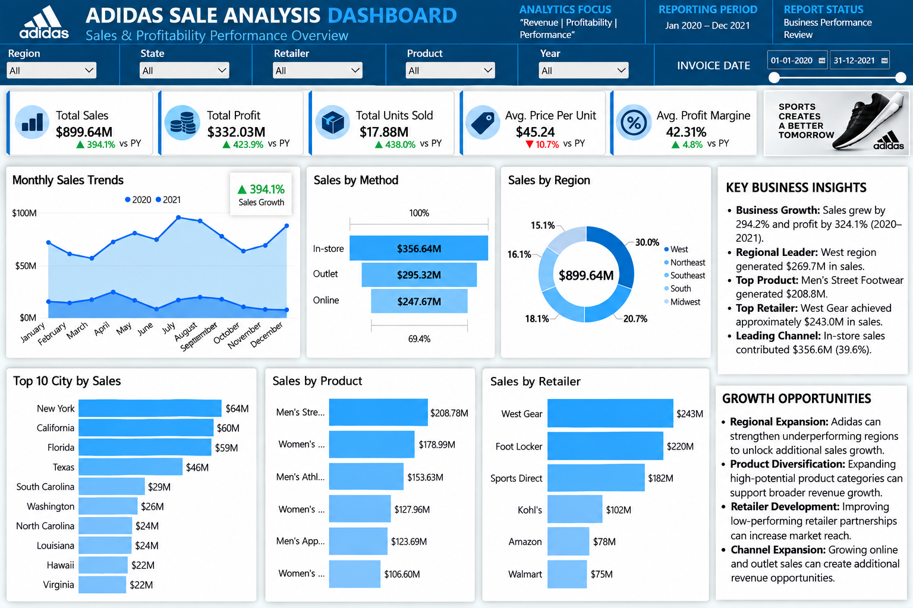

# Adidas Sales Analysis Dashboard

### Business Performance | Sales Insights | Power BI

An interactive **Adidas Sales Analysis Dashboard** built with
Microsoft Power BI to understand sales performance, profitability,
product contribution, regional performance, and business growth.

The primary focus of this project is to convert sales data into
meaningful business insights that support better decision-making.

---

## Dashboard Preview

---

## Business Objective

The objective of this project is to analyze Adidas sales data and
identify important business performance patterns.

The dashboard helps answer key business questions:

- How much revenue is generated?
- How much operating profit is earned?
- Which products contribute most to sales?
- Which regions perform strongly?
- Which retailers contribute to revenue?
- Which sales methods generate higher sales?
- How does business performance change over time?
- How does current performance compare with the previous year?

---

## Business Value

This dashboard provides a consolidated view of sales performance
to support:

- Revenue monitoring
- Profitability analysis
- Product performance evaluation
- Regional performance analysis
- Retailer performance comparison
- Sales channel analysis
- Business growth monitoring

The analysis helps stakeholders identify performance patterns
and areas that require further business investigation.

---

## Key Business KPIs

| KPI | Business Purpose |
|---|---|
| Total Sales | Measures overall revenue generated |
| Total Profit | Measures operating profit |
| Total Units Sold | Measures sales volume |
| Average Price per Unit | Measures average selling price |
| Average Profit Margin | Measures profitability performance |
| Sales Growth | Measures change in revenue over time |
| Profit Growth | Measures change in operating profit |

### Overall Performance Summary

| Metric | Approximately Value |
|---|---:|
| Total Sales |  $899.90M |
| Total Operating Profit |  $332.13M |
| Total Units Sold |  17.89M |
| Average Price per Unit |  $45.22 |
| Weighted Profit Margin |  36.91% |

> Values may vary depending on filters and calculation methods.

---

## Business Insights

### Regional Performance

The West region was identified as a leading contributor to sales
in the analyzed dataset.

This provides an opportunity to investigate the factors
supporting regional performance.

### Product Performance

Men's Street Footwear was identified as a leading product
category by sales.

Product performance analysis can support demand evaluation,
inventory planning, and product strategy.

### Sales Method Performance

The In-store sales method was identified as a major contributor
to sales in the analyzed dataset.

Comparing sales methods helps understand channel contribution
and customer purchasing patterns.

### Performance Trends

Monthly and year-over-year analysis provides visibility into
changes in sales and profitability over time.

These trends can support further investigation into business
performance and planning.

> These insights describe patterns in the analyzed dataset.
> Additional business information is required to determine
> the causes of these patterns.

---

## Dashboard Analysis

The dashboard enables analysis across:

- Products
- Regions
- States
- Cities
- Retailers
- Sales Methods
- Time Periods

### Interactive Filters

- Year
- Region
- State
- City
- Product
- Retailer
- Sales Method

Users can apply filters to investigate specific business
segments and compare their performance.

---

## Business Recommendations

The analysis can support the following business activities:

- Investigate the factors behind strong regional performance.
- Review high-performing product categories.
- Monitor profitability alongside revenue.
- Compare sales method contribution.
- Evaluate retailer-level performance.
- Review monthly sales trends.
- Investigate lower-performing segments.
- Use growth indicators for performance monitoring.

These recommendations should be validated using additional
business and operational data.

---

## Dataset

**Dataset:** Adidas US Sales Dataset

**Period:** January 2020 to December 2021

The dataset includes:

- Retailers
- Products
- Regions
- States
- Cities
- Invoice dates
- Price per unit
- Units sold
- Operating profit
- Operating margin
- Sales methods

[View Dataset](Dataset/Adidas%20US%20Sales_Datasets.xlsx)

---

## Tools Used

- **Power BI:** Business dashboard and visualization
- **Power Query:** Data preparation and transformation
- **DAX:** KPI and growth calculations
- **Excel:** Dataset review
- **GitHub:** Project publishing and version control

---

## Project Resources

### Detailed Project Documentation

[View Project Documentation](Documentation/Project_Documentation.md)

### DAX Measures

- [Calendar Table Measures](DAX/Calendar_table_Measures.md)
- [Sales Performance Measures](DAX/Sales_Performance_Measures.md)
- [Growth Analysis Measures](DAX/Growth_Analysis_Measures.md)
- [Growth Display Measures](DAX/Growth_Display_Measures.md)

---

## Project Outcome

This project demonstrates how sales data can be transformed
into business-focused insights using Business Intelligence.

The dashboard supports analysis of revenue, profitability,
product performance, regional contribution, retailer
performance, and sales methods.

The main focus is on **understanding business performance
and supporting data-driven decision-making**.

---

## Author

**Neeraj Kumar Sahu**

B.Tech Data Science

Interested in Data Analytics, Business Intelligence,
Power BI, and AI-powered analytics.
